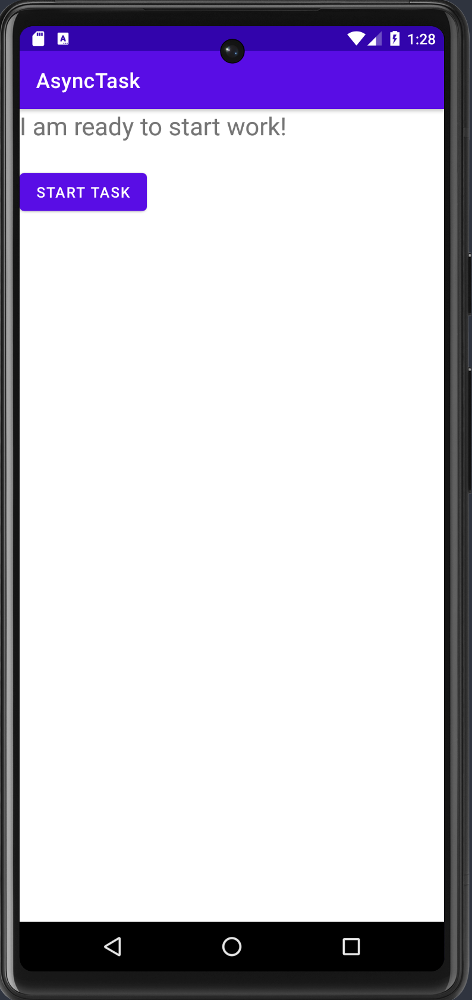

# Async Task

In this codelab, I learned how to add a background task to my Android app using an AsyncTask. 

Specifically,
- How to add an AsyncTask to your app in order to run a task in the background of your app.
- The drawbacks of using AsyncTask for background tasks. 

  
  

