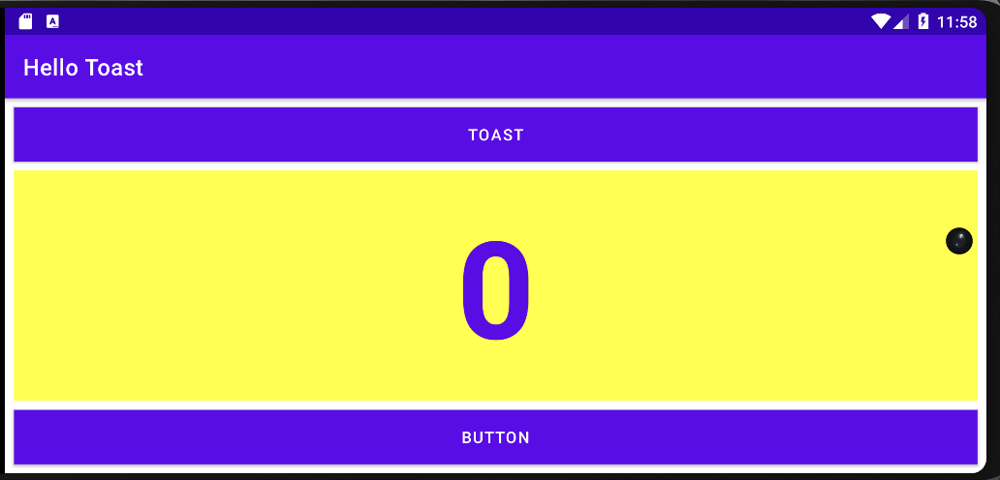
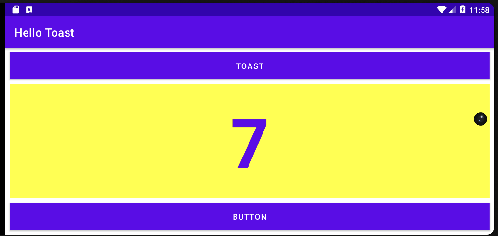
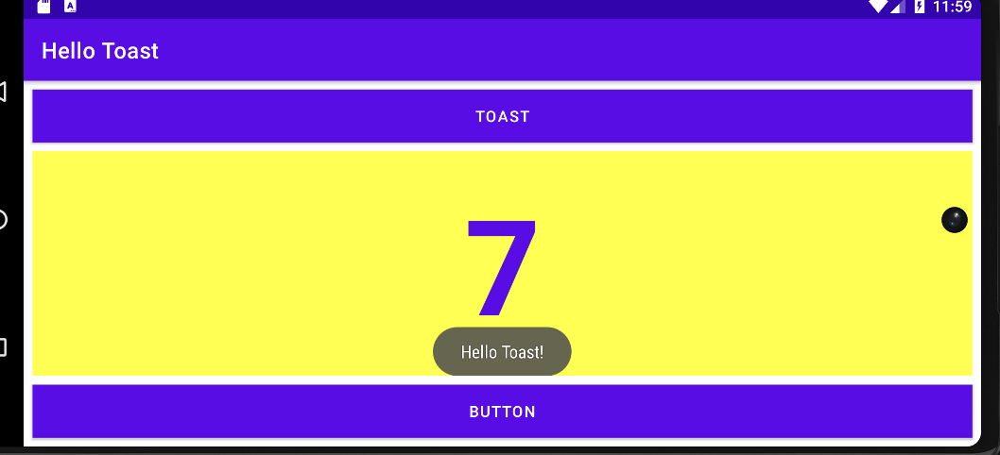
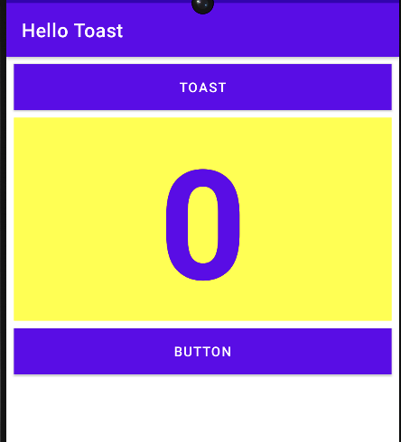
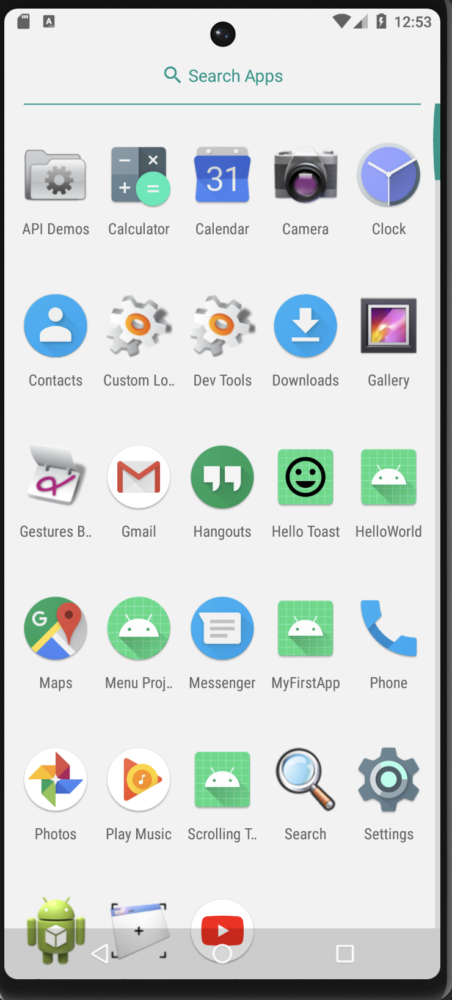

# Hello Toast

In this codelab, I learned about the UI of an Android device and views.  

Specifically,
- How to create an app with interactive behavior.
- How to use the layout editor to design a layout.
- How to edit the layout in XML.  

  
  

 

   
  

 

  

