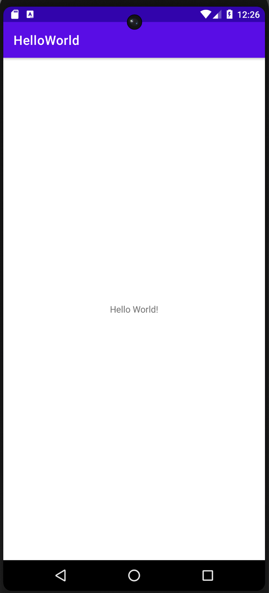

# Hello World

In this codelab, I learned how to install Android Studio. Created and ran my first Android app, Hello World, on an emulator and on a physical device. 

Specifically,
- How to install and use the Android Studio IDE.
- How to use the development process for building Android apps.
- How to create an Android project from a template.
- How to add log messages to your app for debugging purposes. 

  

