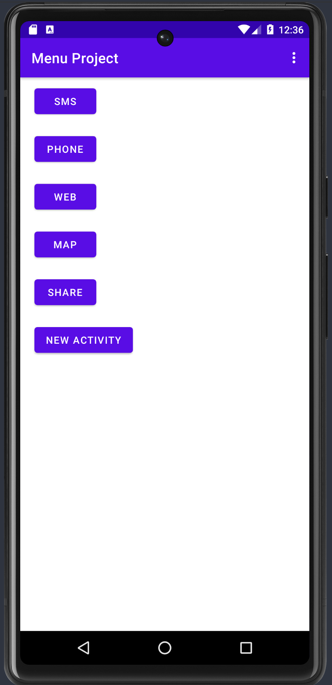
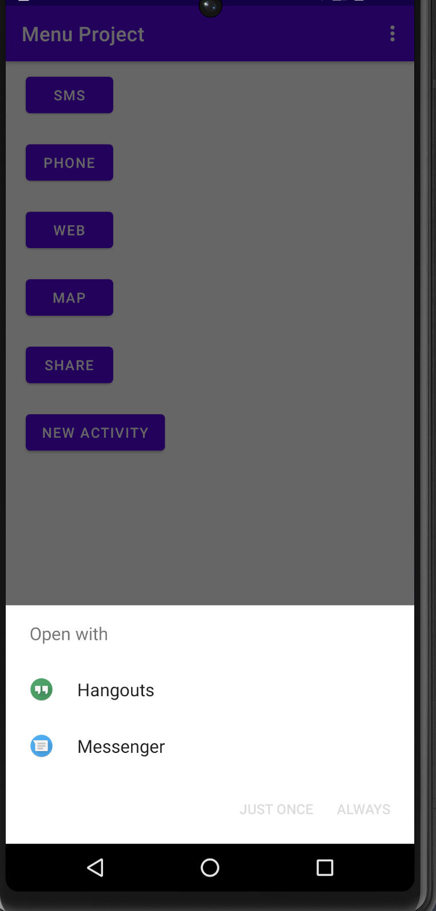
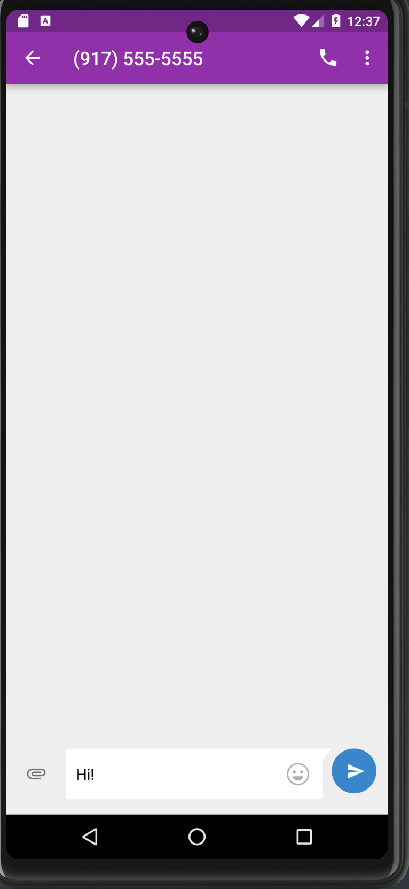
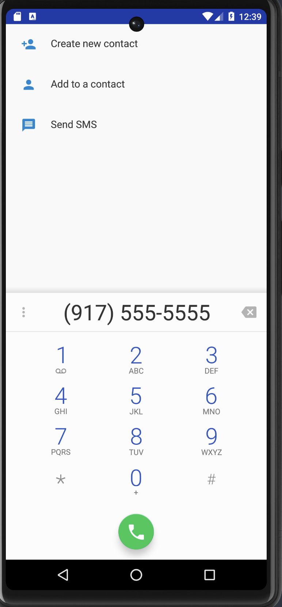
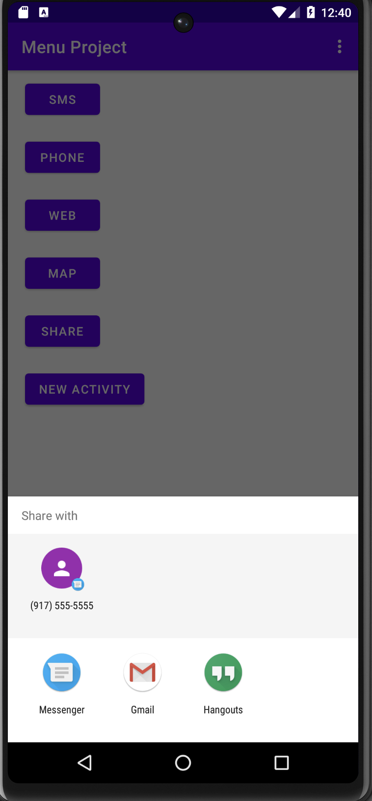
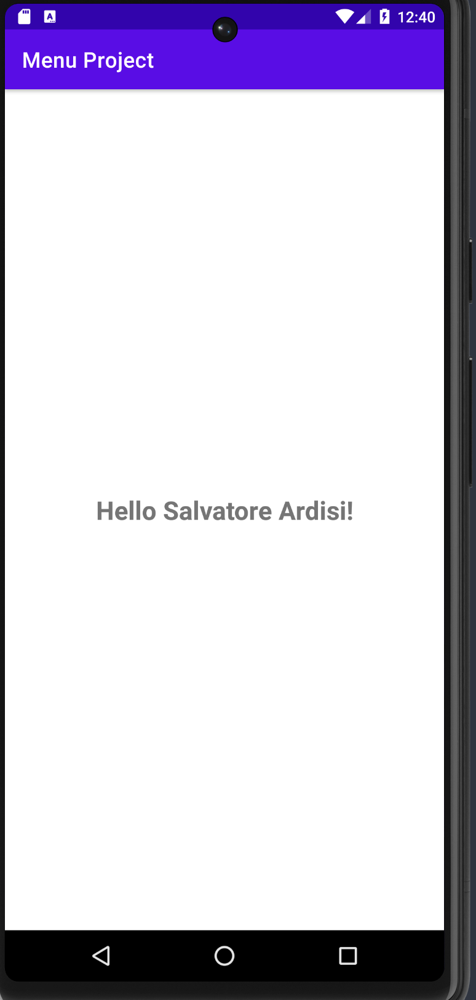

# Menu Project

In this codelab, I learned intents and menus.  

Specifically,
- Understand, define and use Intents
- Understand, define and use Intent filters
- Understand how to update the Manifest to deal with Intents
- Develop apps composed of several activities
- Understand, define and use menus  

  
  

 

  
  

 

  
  

