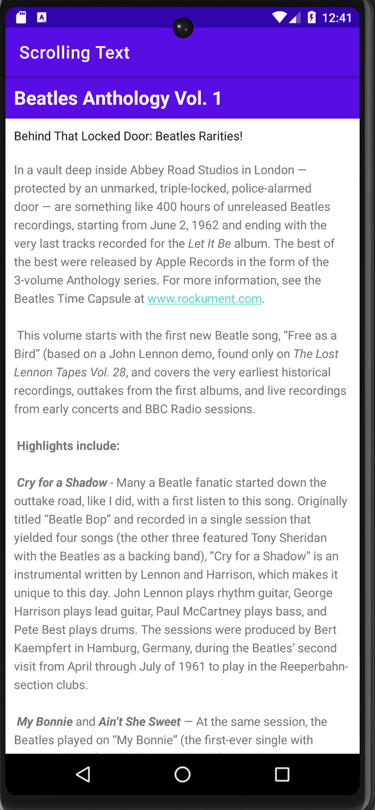
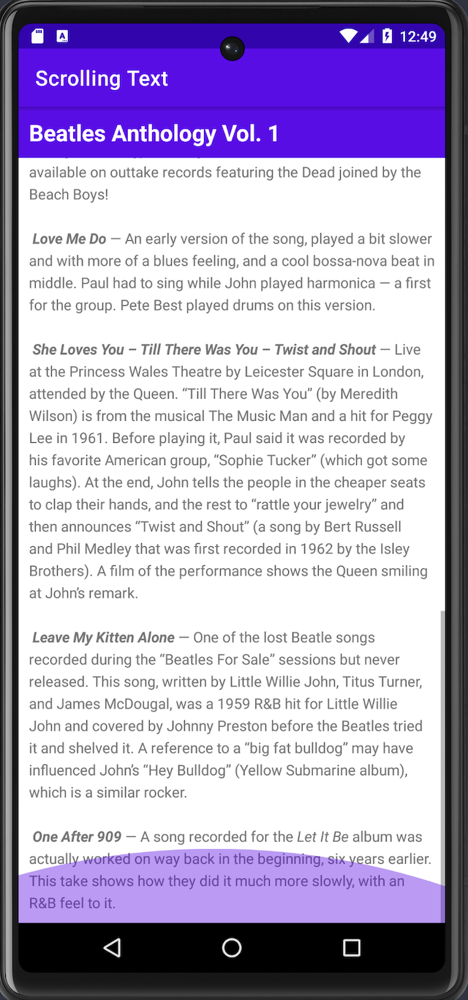

# Scrolling Text

In this codelab, I learned how to work with multiple TextView elements, including one in which the user can scroll its contents vertically.  

Specifically,
- How to use XML code to add multiple TextView elements.
- How to use XML code to define a scrolling View.
- How to display free-form text with some HTML formatting tags.
- How to style the TextView background color and text color.
- How to include a web link in the text. 

  
  

