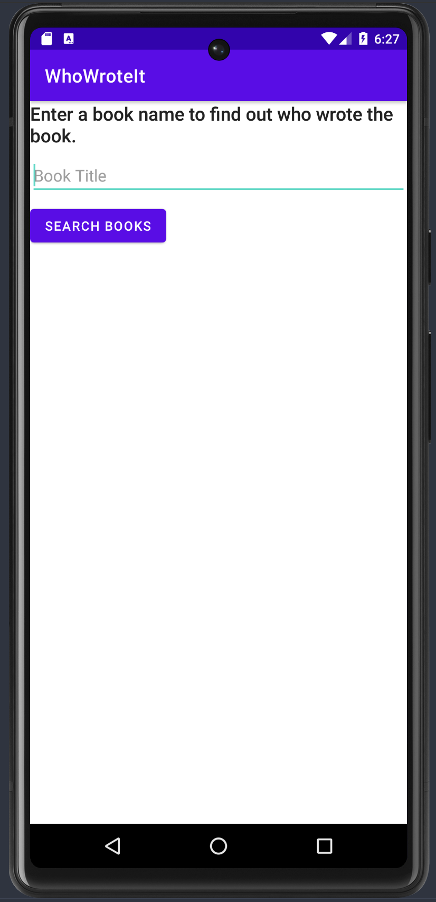
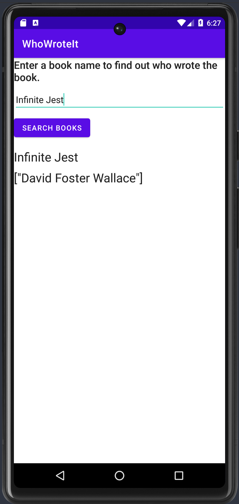

# Who Wrote It

In this codelab, I used an AsyncTask to start a background task that gets data from the internet using a simple REST API. Then uses the Google APIs Explorer to query the Books API, implement the query in a worker thread using an AsyncTask, and display the result in the UI.  

I learned:

- How to use the Google APIs Explorer to investigate Google APIs and to view JSON responses to HTTP requests.
- How to use the Google Books API to retrieve data over the internet and keep the UI fast and responsive.
- How to parse the JSON results from your API query.
- How to implement an AsyncTaskLoader that preserves data on configuration changes.
- How to update the UI using the loader callbacks.  

  
  

