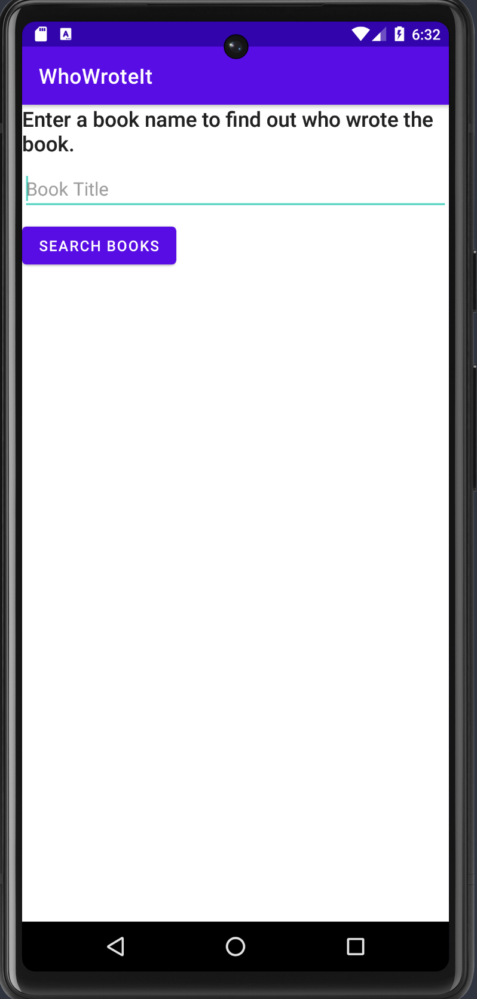
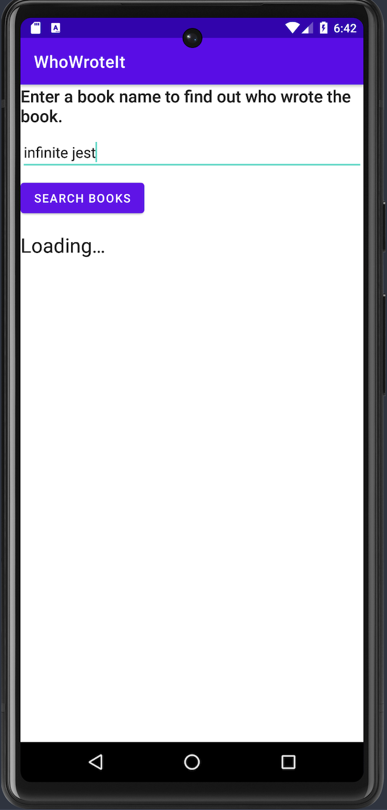
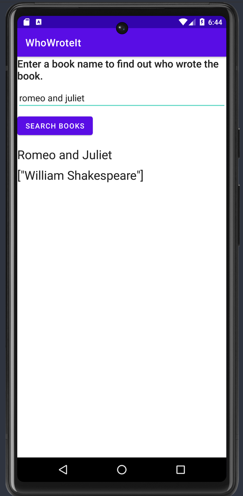

# Who Wrote It Loader

In this codelab, I learned when you use an AsyncTask to perform operations in the background, that background thread can't update the UI if a configuration change occurs while the background task is running. To address this situation, I used the AsyncTaskLoader class  

- AsyncTaskLoader is the loader equivalent of an AsyncTask.
- The results of loadInBackground() are delivered to the UI thread by way of the onLoadFinished() LoaderManager callback.
- AsyncTaskLoader uses an AsyncTask helper class to do work in the background, off the main thread.
- AsyncTaskLoader instances are managed by a LoaderManager.  

  
  
  

